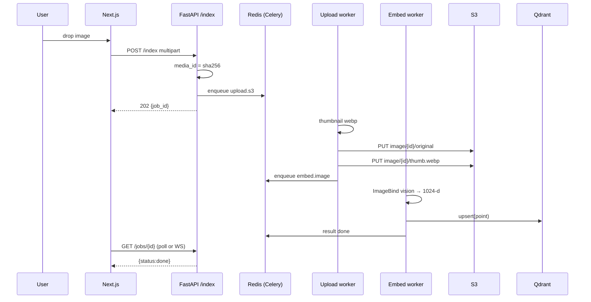
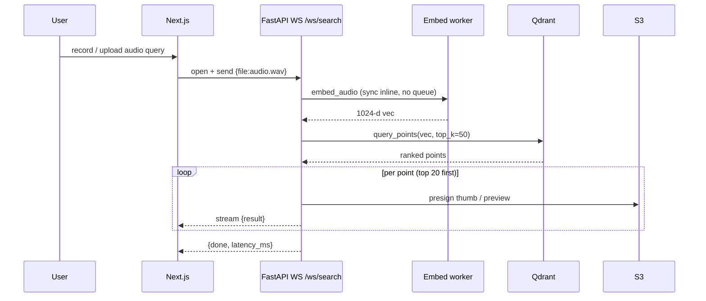
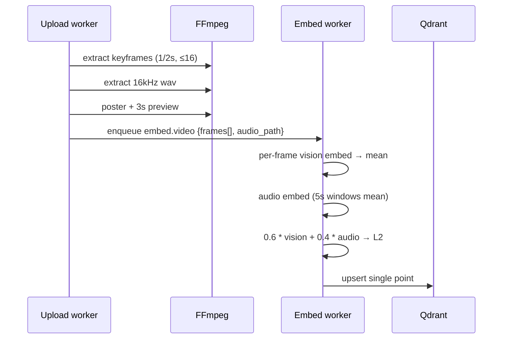
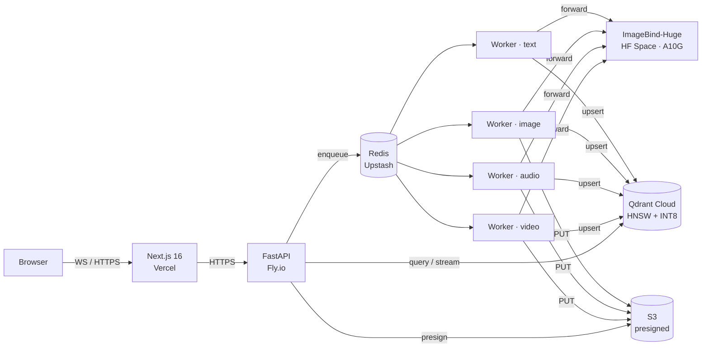

# SYNAPSE_PLAN.md

> Senior staff engineer + product designer audit and v1.0 plan for Synapse — a multimodal vector search engine.
> Stack: Python · FastAPI · Qdrant · Redis · Next.js · ImageBind-Huge · AWS S3 · Docker.
> Target: ship recruiter-grade v1.0 in 7 focused days. Demo video + great README required.

---

## Section 1 — Current State Audit

### 1.1 Implemented features

**Backend (`backend/`)**

| Endpoint | File | Status |
|---|---|---|
| `GET /` | `backend/api/main.py:75` | works |
| `GET /health/health` | `backend/api/routes/health.py:17` | works |
| `GET /health/ready` | `backend/api/routes/health.py:22` | works (probes Redis, Qdrant, S3, CUDA) |
| `POST /api/v1/search` | `backend/api/routes/search.py:27` | partially broken — see §1.6 |
| `POST /api/v1/upload/` | `backend/api/routes/upload.py:19` | broken at runtime — see §1.6 |
| `GET /api/v1/upload/status/{task_id}` | `backend/api/routes/upload.py:43` | works only if Celery worker running |

**Frontend (`frontend/`)**

| Route | File | Status |
|---|---|---|
| `/` (marketing landing) | `frontend/app/page.tsx:1` | exists, low quality |
| `/dashboard/search` | `frontend/app/dashboard/search/page.tsx:1` | works for text search; image-search broken |
| `/dashboard/upload` | `frontend/app/dashboard/upload/page.tsx:1` | placeholder ("Upload Coming Soon") |
| `/api/search` (proxy) | `frontend/app/api/search/route.ts:1` | unused dead route |
| `/api/random` (proxy) | `frontend/app/api/random/route.ts:1` | dead — returns `picsum.photos` URLs |

**Existing landing-page sections** (all in `frontend/components/`)

- `Hero.tsx` — headline + lime gradient + static "query example" card
- `Features.tsx` — 4 static cards
- `Architecture.tsx` — bullet list, NOT a diagram
- `HowItWorks.tsx` — three-step explainer
- `UseCases.tsx` — three plain text cards
- `CTA.tsx` — "Get Started" → empty `https://github.com/`
- `Footer.tsx` — single line
- `Navbar.tsx` — fixed nav (white bg, doesn't match dark hero)

**Infra actually present**

- `docker-compose.yml` — only one service (`backend`). No `qdrant`, no `redis`, no `worker`, no `frontend`.
- `backend/Dockerfile` — Python 3.10 + CPU-only torch (`backend/Dockerfile:11`)
- `workers/Dockerfile` — Python 3.10 + CPU-only torch + celery (`workers/Dockerfile:14`)
- `monitoring/grafana/` — empty dir, no dashboards committed

### 1.2 Tech stack: claimed vs actual

| Component | README claim | Actually in repo |
|---|---|---|
| Backend | FastAPI | ✅ FastAPI 0.109 (`backend/requirements.txt:4`) |
| Vector DB | Qdrant local on `:6333` | ❌ Qdrant **Cloud** only (`backend/.env:8`) — no local container |
| Cache | Redis | ✅ Redis (Upstash) — `backend/.env:14` |
| Queue/broker | "Celery + RabbitMQ" (`Architecture.tsx:14`) | ❌ Celery with **Redis** broker. RabbitMQ never appears anywhere. |
| Workers | "Distributed Celery workers" | ⚠️ Code exists in `workers/` but **no compose service**, never started |
| Embedding model | ImageBind-Huge GPU pipeline | ⚠️ Code calls `imagebind_huge(pretrained=True)` but Dockerfile installs **CPU torch**. `scripts/embedding/embed.py` uses **random placeholder vectors** (`scripts/embedding/embed.py:25`) |
| GPU | "RTX 4060Ti", "GPU-accelerated workers" (`Features.tsx:13`) | ❌ CPU-only Docker images. `MODEL_DEVICE=cpu` overrides `cuda` (`backend/.env:32`) |
| Storage | AWS S3 + presigned URLs | ✅ Working (`backend/core/storage.py`) |
| Postgres | mentioned in `scripts/init_system.py:50` | ❌ Not in compose, not in requirements |
| MinIO | mentioned in scaling section | ❌ Not used (boto3 → S3 only) |

### 1.3 Working vs broken components

**Working:**

- FastAPI boot + `/health/*` endpoints
- Qdrant Cloud connection (`backend/core/qdrant_client.py:5`)
- S3 upload + presign helpers (`backend/core/storage.py`)
- Frontend landing page renders
- Frontend text-search (`frontend/lib/api.ts:3`) hits backend successfully if collection populated

**Broken / runtime errors:**

1. `backend/core/cache.py:13` reads `settings.REDIS_URL` — **`REDIS_URL` is not declared** in `Settings` (`backend/core/config.py:6`). With `extra="ignore"` Pydantic drops the env var → `AttributeError` on first cache call.
2. Same issue: `settings.UPLOAD_DIR` (`backend/services/upload_service.py:13`), `settings.S3_PRESIGNED_EXPIRATION` (declared, ok), `settings.PROJECT_NAME` (declared, ok). `UPLOAD_DIR` and `REDIS_URL` will crash.
3. `workers/worker_tasks.py:13` calls `upload_file_task` with kwarg `source_url=` but task signature is `source_path` (`workers/tasks/upload_tasks.py:36`) → `TypeError`.
4. `workers/tasks/embedding_tasks.py:5` imports `QdrantWrapper` from `core.qdrant_client` — that symbol does not exist in the file.
5. `scripts/init_system.py:54` connects to Postgres `host="postgres"` — no such service.
6. `frontend/lib/api.ts:18` `searchByImage` posts `multipart/form-data` to `/api/v1/search`. Backend route accepts only `application/json` (`backend/api/routes/search.py:13`). Always returns **422**.
7. `frontend/lib/api/client.ts:14` posts to `/api/v1/search/text` — that route does not exist.
8. `frontend/lib/api/client.ts:25` calls `/api/v1/stats` — does not exist.
9. CORS `allow_origins=["*"]` + `allow_credentials=True` (`backend/api/main.py:50`) — **invalid combination**, browsers reject preflight.
10. `backend/api/routes/search.py` always uses `embedder.embed_text(query)` regardless of `request.modality` (`backend/services/search_service.py:42`) — no image/audio/video query support.
11. `backend/test/test_pipeline.py:5` doc says `tests/test_pipeline.py` but file is `test/test_pipeline.py`. Path also embedded in README.
12. `backend/api/routes/upload.py:23` blocks `media_type="text"` so text indexing is impossible via the API.

### 1.4 Why it only runs in Docker (and what fails locally)

`docker-compose.yml` declares **only the `backend` service**. So:

- Qdrant: hits Qdrant Cloud over public HTTPS — works locally if `.env` filled. README's "Qdrant → localhost:6333" claim is false.
- Redis: hits Upstash Redis — same.
- Celery: there is no `worker` service in compose, so uploads always sit in `PENDING` state. README says "Celery worker → auto-running" — false.
- The `volumes: ./backend:/app` mount means containers run host code. CPU-only torch wheel (3GB+) installs at build time.

**Specific local-run errors a fresh dev hits:**

```text
$ pip install -r backend/requirements.txt
ERROR: Could not build wheels for ImageBind   # private git+https repo path
$ uvicorn api.main:app
ImportError: cannot import name 'QdrantWrapper' from 'core.qdrant_client'
AttributeError: 'Settings' object has no attribute 'REDIS_URL'
AttributeError: 'Settings' object has no attribute 'UPLOAD_DIR'
RuntimeError: ImageBind huge weights ~4.5GB not present  (when MODEL_DEVICE=cuda)
```

### 1.5 GPU / cloud-locked dependencies

- ImageBind-Huge: 4.5 GB weights, ~10 s/text-embed and ~6 s/image-embed on CPU. **Practically unusable on free hosts.** The model card pins `torch==2.0.1` while requirements pin `torch==2.1.2`.
- Qdrant Cloud: bound to a single cluster URL (`backend/.env:8`). No local fallback path.
- Upstash Redis: same — no local fallback.
- AWS S3: bucket `synapse-videos` in `ap-south-1`. Presigned URLs expire 1 h.

### 1.6 Dead code / half-finished features

- `scripts/embedding/embed.py:78` — random vectors, marked "TODO: Replace with real ImageBind" (`scripts/embedding/embed.py:39`). Real embedder lives in `backend/core/embeddings.py`. Dual implementations.
- `scripts/data_preparation/{audioset_metadata,laion_sample,vggsound_metadata}.py` — never wired up.
- `scripts/compression/compress.py` + `pq_train.py` — never run; PQ codebooks not present in `data/models/`.
- `frontend/components/SearchBar.tsx` — alternate gradient search bar, unused. `frontend/components/SearchInput.tsx` is the one actually rendered.
- `frontend/components/ImageUpload.tsx` — drag-drop, not used (upload page is "Coming Soon").
- `frontend/lib/api/client.ts` + `frontend/lib/hooks/use-search.ts` + `frontend/types/api.ts` — alternate API layer that nothing imports.
- `frontend/components/search/Masonry.tsx` — not rendered anywhere.
- `frontend/app/api/random/route.ts` — picsum stub, dead.
- `frontend/app/api/search/route.ts` — proxy route, dead (frontend hits backend directly).
- `monitoring/grafana/` — empty.
- `docker-compose.yml:14` `volumes: data:` declared, never mounted.

### 1.7 Tech debt + security

**P0 — security:**

- **Live AWS access key + secret committed to working tree** at `.env:25-26` (also `backend/.env`). `git ls-files` shows `.env` not tracked, but the keys are real and printed. **Rotate immediately.** Same for Qdrant Cloud API key (`.env:9`) and Upstash Redis token (`.env:13`).
- CORS wildcard with credentials (`backend/api/main.py:50`).
- No request auth, no rate limit. `/upload/` accepts any file from any origin.
- `backend/api/routes/upload.py:25` MIME-type check trusts client `Content-Type`. Use `python-magic` or `filetype`.

**P1 — correctness:**

- `Settings.extra = "ignore"` (`backend/core/config.py:30`) silently drops half the env. Switch to `extra="allow"` plus declared fields, or `extra="forbid"` for visibility.
- Singleton patterns (`@lru_cache`, module-level `_embedder`) make tests painful and prevent reload.
- No retries / circuit breakers around Qdrant or S3.
- No structured logging, no request IDs.
- No tests beyond a single integration script.
- Hardcoded magic numbers: `top_k=50`, `BATCH_SIZE=32`, `S3_PRESIGNED_EXPIRATION=3600`. Make config-driven.

**P2 — hygiene:**

- Dual API client layers in frontend.
- Two search bars, two upload components, two mason layouts.
- `next.config.ts` mixes ESM `export default` and CommonJS `module.exports` — the CommonJS line wins.
- Tailwind v4 dependency but `tailwind.config.ts` exists from v3 era.
- `frontend/components/Navbar.tsx` is white, hero is dark — broken visual contract.

### 1.8 README quality score: **3 / 10**

Reasons:
1. Architecture diagram is ASCII art that doesn't match real architecture (no RabbitMQ, no MinIO, Celery has no compose service).
2. Code blocks broken (no language fences, mid-paragraph commands).
3. No screenshots, no demo video, no GIFs.
4. No API reference.
5. No real performance numbers.
6. Marketing copy ("🚀 Overview", "Production-grade") without evidence.
7. `tests/test_pipeline.py` path wrong (it's `backend/test/test_pipeline.py`).
8. Tells you to install NVIDIA toolkit then ships CPU-only Dockerfiles.
9. Setup instructions skip starting Qdrant + Redis containers — they are not in compose.
10. No "what works / what's broken / what's planned" section.

---

## Section 2 — V1.0 PRD

### 2.1 Vision

Synapse turns any input — text, image, audio, or video — into a query against a single shared 1024-dimensional vector space, retrieving across all modalities. **One omnibox. Four input types. One ranked grid.**

### 2.2 Target user + 5 cross-modal use cases

**Target user:** ML / search engineers and creative-tool builders who need a working reference implementation of cross-modal retrieval (and a recruiter who needs proof in 90 seconds).

| # | Query modality | Result modalities | Example |
|---|---|---|---|
| U1 | Text → all | image + audio + video | type "thunderstorm" → thunder audio + storm photos + lightning clips |
| U2 | Image → all | audio + video + text | upload cat photo → cat-meow audio + cat videos |
| U3 | Audio → all | image + video | hum / record beach waves → beach photos + ocean videos |
| U4 | Video → all | image + audio + text | drop a 10s campfire clip → fire-crackle audio + fireplace stills |
| U5 | Text + image (multi-input) → all | all | "winter" + alps photo → snowy peaks audio + ski videos + arctic stills |

### 2.3 Unified search bar — Perplexity-style omnibox

**Single component.** One textarea with three corner buttons:

```
┌─────────────────────────────────────────────────────────────┐
│  🔎  Search anything with anything…                         │
│      [+ image] [+ audio] [+ video]      [⏎ Enter to search] │
└─────────────────────────────────────────────────────────────┘
[ All ] [ Images ] [ Audio ] [ Video ] [ Text ]   ← modality filter pills
```

- **Auto-detect:** if user attaches a file, modality is inferred from MIME type. Pills only filter *result* modalities, not query modality.
- **Multi-modal queries:** user may attach 1 image + type text → backend embeds both, averages on the unit hypersphere, queries once.
- **Recent queries** below bar (chips). **Sample queries** when empty (5 wow-moment seeds, see §6).
- Keyboard: `⌘K` to focus, `⏎` submit, `⇧+⏎` newline, `Esc` clear, `⌘1-5` toggle modality pills.

### 2.4 Result cards per modality

| Modality | Card | Interactions |
|---|---|---|
| Image | `aspect-square` thumb (S3 presigned), hover overlay shows score + filename | click → detail view; hover → 4 % scale, ring-1 ring-accent |
| Audio | 64 px-tall waveform via **wavesurfer.js**, play/pause toggle, duration, score | spacebar plays focused card; auto-pauses other cards |
| Video | poster frame + 3-s preview clip on hover (`<video muted preload="metadata">`), duration badge, score | click → detail with full clip |
| Text | 3-line snippet, source URL, copy-to-clipboard button, score | click → detail with full passage |

**Mixed grid:** CSS columns (`columns-2 md:columns-3 lg:columns-4`). Each card has a **modality badge** in top-left (`<Badge variant="outline">image</Badge>`). Score badge top-right (`{score.toFixed(2)}`).

### 2.5 API surface (v1.0)

| Method | Path | Body | Returns |
|---|---|---|---|
| `POST` | `/api/v1/search` | multipart: `query?: string`, `files?: File[]`, `modalities?: string[]`, `top_k?: number` | `{results[], stats}` |
| `POST` | `/api/v1/index` | multipart: `files: File[]`, `modality: string`, `metadata?: JSON` | `{job_ids[]}` |
| `GET` | `/api/v1/stats` | — | `{counts:{image,audio,video,text}, latency:{p50,p95,p99}, throughput}` |
| `GET` | `/api/v1/jobs/{id}` | — | `{status, progress, error?}` |
| `GET` | `/api/v1/items/{id}` | — | full payload + presigned URLs + neighbours |
| `WS` | `/ws/search` | `{query, files, modalities, top_k}` JSON message | streamed `{result}` frames + final `{done, stats}` |
| `GET` | `/health/ready` | — | (existing, fine) |

**OpenAPI** auto-generated by FastAPI. Pydantic models in `backend/api/schemas.py`.

### 2.6 Storage scheme

```
s3://synapse-prod/
  ├─ image/{id}/original.{ext}
  ├─ image/{id}/thumb.webp           (300px, 80 quality)
  ├─ audio/{id}/original.{ext}
  ├─ audio/{id}/preview.mp3          (32kbps mono, ≤30s)
  ├─ audio/{id}/waveform.json        (peaks array, 256 buckets)
  ├─ video/{id}/original.{ext}
  ├─ video/{id}/preview.mp4          (3s clip, libx264 veryfast)
  ├─ video/{id}/poster.webp          (frame at t=1s)
  └─ text/{id}/payload.json
```

### 2.7 Vector DB topology — **single Qdrant collection** ✅

**Decision:** ONE collection `synapse` with vectors of dim `1024`, distance `Cosine`, plus a **`modality` payload field** indexed for filtering.

**Why one collection (not per-modality):**

1. ImageBind produces a **shared** embedding space — any vector is comparable to any other. Per-modality collections would duplicate the HNSW graph and *prevent* cross-modal retrieval without N parallel queries.
2. Single HNSW index = single warm cache, single quantization run, single snapshot.
3. Filtering by modality at query time is O(log n) when the field is a `keyword` index.
4. Free-tier Qdrant Cloud allows 1 GB of vectors — one collection avoids overhead.

**Schema:**

```python
VectorParams(size=1024, distance=Distance.COSINE, on_disk=False)
HnswConfigDiff(m=16, ef_construct=200, full_scan_threshold=10000)
ScalarQuantization(scalar=ScalarType.INT8, quantile=0.99, always_ram=True)
payload_indexes = {
    "modality":   "keyword",     # image | audio | video | text
    "tags":       "keyword[]",
    "duration_s": "float",
    "created_at": "integer",     # epoch
}
```

### 2.8 Performance targets (v1.0)

| Metric | Target |
|---|---|
| `/search` p50 (text query, 4 k vectors) | **< 120 ms** |
| `/search` p99 | **< 350 ms** |
| `/search` p99 (audio query, 30 s clip) | **< 800 ms** |
| `/index` throughput, image, single GPU L4 | **≥ 60 items/s** |
| `/index` throughput, audio (5 s windows) | **≥ 12 items/s** |
| `/index` throughput, video (1 frame / 2 s, 30 s clip) | **≥ 5 items/s** |
| Concurrent search users | **50** (Fly.io single shared-cpu-2x) |
| Cold start | **< 8 s** including model load |

### 2.9 Deployment plan

| Layer | Provider | Tier | Notes |
|---|---|---|---|
| Frontend | **Vercel** | Free Hobby | Next.js 16 App Router, edge runtime for static |
| Backend API | **Fly.io** | shared-cpu-2x, 1 GB RAM | $0–5/mo. Use CLIP-large fallback (see below) |
| Embedding worker | **Hugging Face Spaces** (Inference API) | A10G community grant (free) | ImageBind-Huge over a small wrapper Space |
| Vector DB | **Qdrant Cloud** | Free 1 GB | already wired |
| Cache + queue | **Upstash Redis** | Free 10 k cmds/day | already wired |
| Object storage | **AWS S3** | Pay-as-you-go (~$0.50/mo at demo scale) | already wired |
| Demo video | **YouTube** unlisted + GIFs in README | free | |

**What needs paid tier and alternatives:**

- *ImageBind-Huge GPU:* if HF Space cold-starts hurt, switch to **CLIP-Large** for image+text only (CPU works) and keep ImageBind for audio/video on a paid HF endpoint ($0.60/h).
- *Qdrant Cloud Free:* caps at 1 GB; with INT8 scalar quant 1024-d vectors = ~1 KB → 1 M points fit. Demo uses ~2 k → fine.

### 2.10 Out of scope for v1.0

User accounts, OAuth, saved searches, share links, billing, admin panel, fine-tuning UI, dataset uploader UI for non-admins, federated search across collections, hybrid BM25 fallback.

---

## Section 3 — Embedding Pipeline Design

### 3.1 Per-modality steps

**Text**

```
input (≤512 tokens)
  → ImageBind tokenizer (BPE)
  → forward → 1024-d
  → L2 normalize
  → Qdrant upsert (modality="text", payload={text, source})
```

**Image**

```
input (jpg/png/webp/heic, any size)
  → PIL open + EXIF-strip + RGB
  → resize shortest edge 224 + center-crop 224
  → ImageBind vision normalise (mean=[0.485,0.456,0.406], std=[0.229,0.224,0.225])
  → forward → 1024-d → L2
  → make 300px webp thumb → S3
  → Qdrant upsert
```

**Audio**

```
input (wav/mp3/m4a/flac/ogg, any sample rate)
  → torchaudio.load + downmix mono
  → resample to 16 kHz
  → split into 5-s windows w/ 1-s overlap
  → for each window: ImageBind audio preprocess → mel spectrogram → 1024-d
  → mean-pool windows on unit hypersphere (sum then L2)
  → make 32kbps preview clip + waveform peaks JSON → S3
  → Qdrant upsert (single point per file)
```

**Video**

```
input (mp4/mov/webm)
  → ffprobe duration
  → ffmpeg keyframes at 1 frame / 2 s (cap at 16 frames)
  → per-frame ImageBind vision embed
  → mean-pool frames
  → ALSO: parallel audio extract → 16 kHz wav → reuse audio pipeline → mean-pool
  → average the visual + audio means (weighted 0.6 / 0.4)
  → poster.webp = frame@t=1s, preview.mp4 = first 3s
  → Qdrant upsert (single point per video; payload.has_audio=bool)
```

### 3.2 Queue architecture — **per-modality Celery queues** ✅

**Decision:** one Celery app, one Redis broker, **three queues** routed by modality:

```python
task_routes = {
    "synapse.embed.text":  {"queue": "embed_text"},   # cheap, big concurrency
    "synapse.embed.image": {"queue": "embed_image"},  # cheap-ish
    "synapse.embed.audio": {"queue": "embed_audio"},  # slow, 1 concurrency / GPU
    "synapse.embed.video": {"queue": "embed_video"},  # slowest, 1 concurrency / GPU
    "synapse.upload.s3":   {"queue": "upload"},       # I/O bound, high concurrency
}
```

**Worker pool sizing (single GPU L4, 24 GB VRAM):**

| Queue | Concurrency | Reason |
|---|---|---|
| `embed_text` | 8 | tokeniser only, no GPU contention |
| `embed_image` | 2 | batch of 32 fits in 4 GB VRAM |
| `embed_audio` | 1 | mel preprocessing dominates; one at a time |
| `embed_video` | 1 | ffmpeg + 16 frames + audio |
| `upload` | 8 | aiobotocore-friendly, network bound |

**Backpressure:** Celery broker visibility timeout 1 h. If a queue depth exceeds **500**, `/index` returns `429 Too Many Requests` + `Retry-After: 30`. Monitor via `celery inspect active`.

**Why Celery (not Arq, not RQ, not Prefect):**

- Already in deps (`backend/requirements.txt:23`).
- Per-task retry / countdown built in.
- Routes by queue, which is exactly what we need for GPU-vs-CPU separation.
- Cost: Arq is leaner but rewriting workers costs a day; not worth it for v1.0.

### 3.3 Qdrant collection schema

Already in §2.7. Indexed payload fields enable filters like `modality IN ["image","audio"]` without scanning.

### 3.4 Failure modes + retry strategy

| Failure | Detection | Retry | Backoff |
|---|---|---|---|
| Model OOM | `torch.cuda.OutOfMemoryError` | 3× w/ batch_size //= 2 | exp |
| Corrupt media | `PIL.UnidentifiedImageError`, `torchaudio` decode err | 0 retries; mark `failed` | — |
| S3 throttle | `botocore` SlowDown / 503 | 5× | exp jitter |
| Qdrant 5xx | `qdrant_client.http.exceptions.UnexpectedResponse` | 3× | linear 5 s |
| Redis down | `redis.ConnectionError` | task auto-requeues via Celery retries | — |
| FFmpeg broken pipe | non-zero exit | 1× | — |

**Idempotency:** every task keyed by deterministic `media_id = sha256(file_bytes)[:16]`. Duplicate uploads short-circuit at the S3 head check (`HeadObject` 200 → skip).

**Dead-letter queue:** `embed_dlq` queue. Cron task drains it once an hour and posts to `/api/v1/admin/failures` log table (Qdrant payload, no DB needed).

### 3.5 Sequence diagrams

**Image index (Mermaid):**



**Audio search (Mermaid):**



**Video index (Mermaid):**



---

## Section 4 — Screen Inventory + UI Prompts

**Global constraints (apply to every prompt):**

> Next.js 15 App Router, TypeScript, Tailwind v4, **shadcn/ui** primitives, **Framer Motion** for animation, **Lucide** icons, dark mode default. Color tokens: `slate-950` background, `slate-100` foreground, accent `emerald-400` (single accent — replace the existing lime-400). Mobile-first responsive. Keyboard-navigable (focus rings on every interactive element, `prefers-reduced-motion` respected). Every screen must ship empty-state, loading-state, and error-state. Use `Suspense` boundaries on server components; `<Skeleton />` on client. Reference style: linear.app density + perplexity.ai search ergonomics + tldraw.com playfulness.

---

### 4a. Landing — `/`  (existing, **needs-rework**)

**Purpose:** convert recruiter / engineer in 15 s. Must answer: *what is this, what's novel, how do I try it, what's it built on*.

**Inspiration:** [linear.app](https://linear.app), [vercel.com/ai](https://vercel.com/ai), [perplexity.ai](https://perplexity.ai)

**Prompt:**

> Build a single-page Next.js 15 marketing landing for **Synapse — multimodal vector search**. Sections, in order: (1) sticky `Navbar` (`shadcn` `NavigationMenu`, transparent on top, blurred slate-900/60 on scroll) with logo word-mark "Synapse" + emerald dot, links: Search · Index · Architecture · GitHub. (2) Hero: 96 px headline `Search anything with anything.` with the verb cycling through `image · audio · video · text` via a Framer-Motion `AnimatePresence` text-rotator (200 ms enter/exit, 1.6 s hold). Sub-copy 18 px slate-400 max-w-prose. Two CTAs: emerald primary `Try the demo →` linking `/search`, ghost secondary `View architecture` linking `/architecture`. Right side: live "demo card" rendering an actual `/api/v1/search` to a hard-coded "thunderstorm" query, showing 4 result cards (image+audio+video+text) animating in with stagger 80 ms. (3) Bento grid (3-2-3 desktop, stacked mobile): one large card with the cross-modal demo loop (autoplay muted video of the search), four small cards: ImageBind one-space, Qdrant HNSW, S3+presigned, FastAPI streaming. Use `shadcn` `Card` with `border-slate-800 bg-slate-900/40`. (4) Architecture mini section linking to `/architecture` with a single Mermaid-rendered diagram (use `mermaid.js` client-side). (5) Numbers strip: real measured `p50` / `p95` / total points — read from `/api/v1/stats` at build time via `generateStaticParams` revalidate=60. (6) Final CTA: GitHub stars badge + "Watch the 90s demo" link. (7) Footer: minimal three-column. Animations: Framer Motion `whileInView` for each section, `viewport: { once: true, margin: "-20%" }`, `transition: { duration: 0.5, ease: [0.22,1,0.36,1] }`. Empty state for the live demo card: skeleton with shimmering placeholder cards. Error state: collapsed inline note "Demo unavailable, try /search". A11y: `prefers-reduced-motion` disables all transforms, only opacity transitions remain.

---

### 4b. Search Hub — `/search` (no query)  (**new**)

**Purpose:** the omnibox landing. Empty-but-inviting. This is the screen pasted into the demo video first.

**Inspiration:** [perplexity.ai](https://perplexity.ai), [exa.ai](https://exa.ai), [tldraw.com](https://tldraw.com)

**Prompt:**

> Centered single-column `min-h-dvh grid place-items-center` page. Top: small word-mark + tagline. Center: the **Synapse omnibox** — a `shadcn` `Card` 720 px wide with rounded-2xl border-slate-800. Inside: `Textarea` autosize (1–6 rows), placeholder `Search anything with anything…`, autofocus. Below the textarea, a flex row: left side three `Button variant="ghost" size="sm"` with Lucide icons `Image`, `AudioLines`, `Film` to attach files (each opens a hidden `<input type="file">` with appropriate `accept`); right side a primary `Button` showing `⌘ + ⏎`. Show attached files as `Badge` chips above the textarea with an X to remove. Below the card, a horizontal scroll of **modality filter pills** (`ToggleGroup` with `All · Images · Audio · Video · Text`, default All). Below pills, a section labelled `Try one of these →` with 5 sample queries (chips, click-to-fill): `thunderstorm`, `cat purring`, `ocean waves at sunset`, `fireplace crackle`, `electric guitar solo`. Below sample queries, a section `Recent searches` reading from `localStorage.synapse:recent` (last 8). On submit (`⌘+⏎` or button), `router.push('/search?q=' + encoded + '&m=' + modalities.join(','))`. Animations: card fades in with translateY(8px) on mount; pill toggle uses Framer Motion `layout`. Loading state: button shows `Loader2` spinner. Error state: inline `<Alert variant="destructive">` above card. Empty state IS this screen. A11y: `aria-label="Search Synapse"` on textarea, focus ring `ring-2 ring-emerald-400`. Mobile: card full-width with 16 px padding.

---

### 4c. Search Results — `/search?q=…`  (existing `/dashboard/search`, **needs-rework**)

**Purpose:** show ranked, mixed-modality results streaming in.

**Inspiration:** [perplexity.ai](https://perplexity.ai), [pinterest.com](https://pinterest.com), [are.na](https://are.na)

**Prompt:**

> Two-column layout `lg:grid-cols-[260px_1fr]` with `Sidebar` left and results right. Top of right column: a compact omnibox (same component as 4b but `size="sm"`) showing the active query and chips for attached files. Sidebar: filters — modality `Checkbox` group, score-threshold `Slider` 0–1 default 0.0, duration range for audio/video, sort `Select` (Relevance · Newest · Duration). Sidebar collapses to a `Sheet` on mobile (button `Filters` opens it). Results: a CSS-columns mixed grid (`columns-1 sm:columns-2 md:columns-3 xl:columns-4 gap-4`) with `break-inside-avoid` on each card. Stream results via WS `/ws/search`: open on mount, send query+filters as JSON, append cards as they arrive with Framer Motion `<AnimatePresence>` + `layout`. Each card varies by `modality`: see PRD §2.4. Show a sticky `<HeaderBar>` with result count + latency (`{results.length} results · 142 ms`) once first frame arrives. **Loading state:** stream first 8 skeleton cards (random 200–400 px heights) before WS connects. **Empty state:** illustration (single `lucide-react` `SearchX` 64 px) + "No matches. Try removing filters or rewording." with a `Button` to clear filters. **Error state:** retry button + collapsed error detail. Pagination: not paginated; cap top_k at 50 server-side, scroll = done. Audio cards initialise wavesurfer.js lazily on intersection-observer to keep TTI low. Video cards `preload="none"`, swap to `preload="metadata"` on hover. A11y: each card is a `<Link>` with `aria-label="{modality} result, score {score}"`. Reduced motion disables stagger.

**Data shape from API (WS frames):**

```ts
type Frame =
  | { type: 'result'; id: string; modality: 'image'|'audio'|'video'|'text';
      score: number; thumb_url?: string; preview_url?: string;
      payload: Record<string, unknown> }
  | { type: 'done'; latency_ms: number; total: number };
```

---

### 4d. Index Upload — `/index`  (existing `/dashboard/upload` is placeholder, **new**)

**Purpose:** drag-drop ingestion playground. Recruiter must see it work in real-time.

**Inspiration:** [uploadthing.com](https://uploadthing.com), [vercel.com/storage](https://vercel.com/storage), [linear.app](https://linear.app)

**Prompt:**

> Three-column `lg:grid-cols-3 gap-6` layout, one column per modality (Images · Audio · Video). Each column is a tall `Card` with a giant dashed dropzone (`border-dashed border-2 border-slate-700`) and a per-modality icon + accept hint. Drag-over state turns the border emerald-400 and shows a 4 % background tint. On drop, files appear as a stacked list of mini cards inside the column with: thumbnail (image: blob URL; audio: lucide AudioLines; video: poster blob), filename, size, an animated `Progress` bar bound to job status, and a status `Badge` (`Uploading · Embedding · Indexed · Failed`). Each card shows steps via Framer-Motion `LayoutGroup` morphing the progress bar from indeterminate (S3 upload) → determinate (% from worker callback) → success check. Above the columns: a single text-paste section "Or paste URLs (one per line)" with a `Textarea` and a `Button` "Index URLs"; backend resolves each URL, sniffs MIME, routes to right pipeline. Below: **Recent uploads** table (`shadcn` `Table`) showing last 20 (read from `/api/v1/items?recent=20`), columns: Modality · Filename · Status · Indexed at · Open. Live updates via the same `/ws/search` socket subscribing to `events:indexed`. Loading state: skeleton table rows. Empty state: dropzones only, table hidden. Error state: per-card `Alert` with retry button. A11y: dropzones have `role="button"` and `aria-label="Drop {modality} files"`; keyboard `Enter`/`Space` opens file picker. Toast (sonner) on each success.

**Data shape from API:**

```ts
POST /api/v1/index → 202 {jobs:[{id, modality}]}
WS  /ws/jobs    → {job_id, status:'uploading'|'embedding'|'indexed'|'failed', progress:0..1, error?}
```

---

### 4e. Detail View — `/item/[id]`  (**new**)

**Purpose:** showcase a single item + cross-modal "more like this".

**Inspiration:** [are.na](https://are.na), [pinterest.com](https://pinterest.com/pin), [soundcloud.com](https://soundcloud.com)

**Prompt:**

> Two-column `lg:grid-cols-[1fr_360px]`. Left: hero player keyed by modality. Image → `next/image` full-width with intrinsic ratio. Audio → wavesurfer.js full-width waveform with playhead, transport controls under, current/total time, seek by click. Video → custom `<video controls>` with poster, playback speed `Select`. Text → typographic prose `prose prose-invert max-w-prose`. Right: metadata `Card` showing modality `Badge`, size, duration, indexed-at, all payload key/values via `Description` list. Below the hero: section `More like this — across modalities` rendering a horizontal `Carousel` (`embla-carousel-react`) of 12 nearest neighbours from `/api/v1/items/{id}/neighbours?cross=true`, each card same renderer as the search grid. Animations: hero fades in with slight scale-up; the metadata column slides in from right (only on first paint). Loading state: full-page skeleton. Empty state (item missing): `<EmptyState icon={SearchX}>` with a button back to `/search`. Error state: inline `Alert` above carousel if neighbours fetch fails — hero still works. A11y: ARIA-labelled audio/video, keyboard scrubbing.

**Data shape:**

```ts
GET /api/v1/items/{id} → {
  id, modality, score?, payload, urls:{original, thumb?, preview?, waveform?},
  duration_s?, created_at, neighbours_url
}
```

---

### 4f. Stats Dashboard — `/stats`  (**new**)

**Purpose:** prove this is real. Recruiter screenshot magnet.

**Inspiration:** [vercel.com/dashboard](https://vercel.com/dashboard), [planetscale.com/dashboard](https://planetscale.com/dashboard), [grafana](https://grafana.com)

**Prompt:**

> Page header: title `System Stats` + subdued `Live · 2026-01-12 14:33 UTC`. KPI strip — four `Card`s in a `grid-cols-2 lg:grid-cols-4 gap-4`: **Total points** (number with abbr `.toLocaleString`), **Per-modality** sparkline (`recharts` `<AreaChart>` 60 buckets last hour, four overlaid lines colour-coded), **p50 latency**, **p99 latency**. Below KPIs, two charts side-by-side: (1) **Indexing throughput** stacked bar by modality, last 24 h; (2) **Search latency p50/p95/p99** line chart, last 24 h. Below charts: **Qdrant health** `Card` showing collection name, status, vector count, RAM usage, indexed segments, with a green/amber dot. Below health: **Recent searches** `Table` (last 20, redacted: query length only + modality + latency + result count). Data fetched via `useQuery(['stats'], fetchStats, { refetchInterval: 5000 })`. Use `recharts` with `<ResponsiveContainer>`, all axes muted slate-500, gridlines slate-800. Animations: numbers count up via Framer Motion `useMotionValue`+`useTransform` 600 ms. Loading state: skeleton KPI cards + chart shimmers. Empty state: `No data yet` with a CTA to `/index`. Error state: per-card `Alert` plus a `Retry` button — partial failure must not blank the page. A11y: every chart accompanied by a textual summary in a `<dl>` for screen readers; keyboard tab cycles through cards, Enter opens a sheet with raw JSON.

---

### 4g. Architecture — `/architecture`  (**new**)

**Purpose:** explain the system. Demo video links here.

**Inspiration:** [linear.app/method](https://linear.app/method), [vercel.com/ship](https://vercel.com/ship), [tldraw.com](https://tldraw.com)

**Prompt:**

> Hero strip: video embed (YouTube unlisted, 16:9, lazy iframe) of the 90s demo. Below: **System diagram** rendered with [`reactflow`](https://reactflow.dev) — nodes for `Browser`, `Next.js`, `FastAPI`, `Redis`, `Celery workers (text/image/audio/video)`, `ImageBind`, `Qdrant`, `S3`. Edges labelled with protocols (`HTTPS`, `Redis`, `S3 PUT`, `gRPC`). On node click, the right side opens a `Sheet` with: 1-paragraph rationale, the file path in repo (clickable to GitHub), the alternatives considered, and the perf impact. Below the diagram, three sections (`Tabs`): **Why ImageBind** (one shared space, citing Meta paper), **Why Qdrant** (HNSW + scalar quantization tradeoffs), **Why Celery on Redis** (queue routing for GPU vs CPU, why not Arq). Each tab includes 1 inline benchmark chart (`recharts`) with real numbers. Bottom: `Latency budget` waterfall diagram (custom `motion.div` segments) summing to p99. Animations: nodes pulse on hover, edges animated `<motion.path>` flow direction matching real request. Loading state: ghost diagram skeleton. Empty state: not applicable (static page). Error state: not applicable. A11y: diagram has a hidden `<ol>` linearised version for screen readers; reduced-motion disables edge animation.

---

## Section 5 — Gap Analysis + Task Backlog

### 5.1 Per-screen gaps

| Screen | Current state | PRD state | Gap |
|---|---|---|---|
| `/` | Static dark page, lime, broken contrast Navbar | Animated hero, live demo card, bento, stats strip, video CTA | Replace 80 % of content; rewrite Navbar; new hero; new bento; new architecture preview; live demo card; stats strip |
| `/search` (hub) | Does not exist | Omnibox + pills + samples + recents | New page |
| `/dashboard/search` | Exists, only text + image | `/search?q=…` mixed grid streaming | Rename/move to `/search?q=`; rewrite results; switch to WS; add filters sidebar; per-modality cards |
| `/dashboard/upload` | "Coming Soon" | `/index` 3-column dropzones, URL paste, recent table | New page |
| `/item/[id]` | Does not exist | Detail view + neighbours carousel | New page |
| `/stats` | Does not exist | KPI dashboard | New page |
| `/architecture` | `Architecture.tsx` is a 6-line bullet list | reactflow interactive diagram + tabs + chart | New page |

### 5.2 Per-API gaps

| Endpoint | Current | PRD | Gap |
|---|---|---|---|
| `POST /api/v1/search` | JSON only, text-only embed regardless of modality, broken for image | multipart, multi-input, all modalities | Rewrite to multipart; route per modality; support multi-input averaging |
| `POST /api/v1/index` | Lives at `/api/v1/upload/`, single file, no text | multipart + URLs, all four modalities incl. text | Rename, accept arrays, accept URLs, support text |
| `GET /api/v1/stats` | Missing | counts, latencies, health | New |
| `GET /api/v1/jobs/{id}` | `/upload/status/{id}` returns Celery state only | + progress %, error string | Refactor + add progress |
| `GET /api/v1/items/{id}` | Missing | full payload + presigned URLs + neighbours | New |
| `WS /ws/search` | Missing | streaming results | New |
| `WS /ws/jobs` | Missing | live job updates | New |

### 5.3 Per-infra gaps

| Component | Current | PRD | Gap |
|---|---|---|---|
| `docker-compose.yml` | only `backend` | full local stack | Add `qdrant`, `redis`, `worker_text`, `worker_image`, `worker_audio_video`, optional `frontend` |
| Worker process | Defined but not running | One supervised process per queue | Compose entry + healthchecks |
| Settings | Half the env unread (extra=ignore) | All declared, validated | Rewrite `Settings` |
| Embedder | ImageBind-Huge wired but device defaults to `cuda:0` | Auto-detect, allow CPU+CLIP fallback | Add CLIP fallback path |
| Tests | one integration script | unit (services) + 1 integration (search) + 1 e2e (Playwright) | Add tests |
| CI | none | GitHub Actions: lint/test/typecheck/build | Add workflow |
| Secrets | live keys in `.env` | all rotated, only example committed | **P0: rotate** + `.env.example` |
| Observability | `X-Process-Time` header only | Prometheus `/metrics` + structured logs + request IDs | Add `prometheus-fastapi-instrumentator` + `structlog` |
| Deploy | no scripts | Vercel + Fly + HF Space | Add `fly.toml`, `Dockerfile.gpu`, HF Space repo |

### 5.4 Backlog table (P0 → P2, 7-day plan)

| # | Title | Files | Acceptance criteria | Effort | Priority | Depends on |
|---|---|---|---|---|---|---|
| 1 | **Rotate leaked credentials** | `.env`, `backend/.env` | new AWS user/key pair created with read/write only on `synapse-prod` bucket; old key disabled in IAM; new Qdrant API key minted; new Upstash token minted; verify with `/health/ready` | S | **P0** | — |
| 2 | Fix `Settings` to declare every env var | `backend/core/config.py` | all attributes accessed by `cache.py`, `upload_service.py`, `celery_app.py` resolve; `extra="forbid"` in tests | S | **P0** | 1 |
| 3 | Compose stack (qdrant, redis, worker, frontend) | `docker-compose.yml`, `backend/Dockerfile`, `workers/Dockerfile`, `frontend/Dockerfile` | `docker compose up` brings up local Qdrant, Redis, backend, worker(s), frontend; `/health/ready` green; one e2e search succeeds | M | **P0** | 2 |
| 4 | Tighten CORS, add rate limit, add `python-magic` MIME check | `backend/api/main.py`, `backend/api/routes/upload.py` | preflight succeeds from `localhost:3000` only; no `*` + credentials; magic bytes verified; `slowapi` 30 req/min/IP | S | **P0** | 2 |
| 5 | Single Qdrant collection + payload index migration | `scripts/qdrant/create_collection.py`, `backend/services/migrations.py` (new) | script idempotent; `modality` indexed; INT8 quant on; HNSW m=16 ef=200 | S | **P0** | 3 |
| 6 | `POST /api/v1/index` multipart for all 4 modalities + URL list | `backend/api/routes/index.py` (new), `backend/services/index_service.py` (new) | accepts text strings, file uploads (image/audio/video), URL list; routes to per-modality task; returns `{jobs:[{id,modality}]}`; idempotent on `media_id=sha256[:16]` | M | **P0** | 3,5 |
| 7 | Per-modality embed tasks (image, audio chunked, video keyframes+audio) | `workers/tasks/embed_image.py`, `embed_audio.py`, `embed_video.py`, `embed_text.py` | each task computes 1024-d normalised vector; audio mean-pools 5s windows; video mean-pools ≤16 frames + audio; idempotent upsert | L | **P0** | 6 |
| 8 | `POST /api/v1/search` multipart + multi-input + cross-modal | `backend/api/routes/search.py`, `backend/services/search_service.py` | text/image/audio/video query; multi-input averages; modality filter via payload; returns within p99<350 ms text | M | **P0** | 7 |
| 9 | `WS /ws/search` streaming | `backend/api/ws/search.py` (new), `frontend/lib/ws.ts` (new) | streams results as they're presigned; closes after `done` frame | M | P1 | 8 |
| 10 | `GET /api/v1/items/{id}` + `/neighbours` | `backend/api/routes/items.py` (new) | returns full payload + presigned URLs + 12 cross-modal neighbours via `recommend` | S | P1 | 8 |
| 11 | `GET /api/v1/stats` (counts, latencies, throughput) | `backend/api/routes/stats.py`, `backend/services/metrics.py` | uses `prometheus-fastapi-instrumentator` for latency, Qdrant `count` for points, Redis ZSET ring buffer for throughput | M | P1 | 8 |
| 12 | Replace landing page (Hero, Bento, Live Demo card, Stats strip, video CTA) | `frontend/components/{Hero,Bento,LiveDemo,StatsStrip,VideoCta,Navbar,Footer}.tsx`, `frontend/app/page.tsx` | matches §4a prompt; Lighthouse ≥ 95 desktop; `prefers-reduced-motion` honoured | L | P0 | 8 |
| 13 | Build `/search` hub | `frontend/app/search/page.tsx`, `frontend/components/Omnibox.tsx`, `frontend/components/ModalityPills.tsx` | omnibox accepts text+files; pills toggle; recents persist | M | P0 | 8 |
| 14 | Rebuild `/search?q=…` results with WS streaming + per-modality cards | `frontend/app/search/Results.tsx`, `frontend/components/cards/{Image,Audio,Video,Text}Card.tsx` | WS streams cards in; wavesurfer lazy on scroll; layout-stable | L | P0 | 9 |
| 15 | Build `/index` 3-column dropzone + URL paste + recents table | `frontend/app/index/page.tsx`, `frontend/components/Dropzone.tsx` | drag/drop works for image/audio/video; URL paste works; live progress via WS | L | P1 | 9 |
| 16 | Build `/item/[id]` detail + neighbours carousel | `frontend/app/item/[id]/page.tsx` | per-modality hero player; neighbours from `/api/v1/items/{id}/neighbours` | M | P1 | 10 |
| 17 | Build `/stats` dashboard | `frontend/app/stats/page.tsx` | recharts KPIs + sparkline + Qdrant health | M | P1 | 11 |
| 18 | Build `/architecture` reactflow page | `frontend/app/architecture/page.tsx` | interactive diagram with sheet on node click; 90s demo embed | M | P2 | 12 |
| 19 | Demo dataset download + index script | `scripts/demo_dataset/{download.py,index.py}` | downloads ~500/modality (Unsplash/ESC-50/Pexels/Wikipedia) under 1 GB; `python index.py --api http://localhost:8000` indexes all | M | P0 | 6 |
| 20 | 90s demo video | `docs/demo.mp4`, `README.md` | recorded screen capture, captions burned in, hosted on YouTube unlisted, embedded in README + landing | M | P0 | 12,14 |
| 21 | README rewrite | `README.md` | matches §8; all real numbers, no fake claims, one-command quickstart works | M | P0 | 3,12 |
| 22 | Deploy frontend to Vercel | `vercel.json`, env on Vercel | `synapse.vercel.app` serves landing + search | S | P1 | 12 |
| 23 | Deploy backend to Fly.io (CLIP fallback profile) | `fly.toml`, `Dockerfile.fly` | `api.synapse.app` answers `/health/ready` 200 | M | P1 | 8 |
| 24 | HF Space wrapper for ImageBind | `infra/hf_space/` (new) | Space with FastAPI POST /embed accepts modality+files, returns 1024-d JSON; backend uses it when `EMBED_BACKEND=hf` | M | P2 | 7 |
| 25 | GitHub Actions: lint+typecheck+test | `.github/workflows/ci.yml` | on PR runs `ruff`, `mypy`, `pytest`, `tsc --noEmit`, `next build` | S | P1 | 2 |
| 26 | Unit tests for services + 1 e2e with Playwright | `backend/tests/`, `frontend/tests/` | ≥ 70 % coverage on `services/*`; Playwright e2e: index a fixture image, search, see it in results | L | P2 | 8 |

### 5.5 Day-by-day execution plan (7 focused days)

**Day 0 (today, 2026-05-05) — pre-flight (≈2 h):** rotate keys (#1), declare Settings (#2), set up `.env.example`, `make` targets, branch `v1`.

**Day 1 — backend infra + ingest (P0 unblocks everything else):** #3 compose stack · #4 CORS+rate-limit+magic · #5 Qdrant collection · #6 `/index` route. End-of-day: `curl -F file=@cat.jpg /api/v1/index` returns 202 and the worker logs an embedding.

**Day 2 — embeddings + search:** #7 four embed tasks (image first, then text, then audio, then video) · #8 multipart `/search`. End-of-day: text→all and image→all queries work end-to-end against ~50 hand-indexed items.

**Day 3 — demo dataset + UI shell:** #19 demo dataset download + index script (run overnight, ~500 per modality) · #12 landing page (Hero + Bento), #13 `/search` hub. End-of-day: landing page deployable, omnibox routes to results.

**Day 4 — results screen:** #14 `/search?q=` results with WS, #9 WS endpoint, per-modality cards (image + audio first). End-of-day: visible streaming mixed-grid.

**Day 5 — index + detail + stats:** #15 `/index` UI, #10 `/item/{id}`, #16 detail page, #11 `/stats`, #17 stats page. End-of-day: every screen in PRD renders.

**Day 6 — architecture, deploy, polish:** #18 `/architecture`, #22 Vercel, #23 Fly. Sand off rough edges. Lighthouse pass.

**Day 7 — demo video + README + ship:** #20 record 90s demo, #21 rewrite README, final QA. Tag `v1.0.0`, post to HN/Show HN.

P2 items (#24 HF Space, #25 CI, #26 tests) — bleed into week 2 but don't block ship.

---

## Section 6 — Demo Dataset Plan

### 6.1 Spec — ~500 items per modality, copyright-clean, ≤2 GB total

| Modality | Count | Source | License | Notes |
|---|---|---|---|---|
| Image | 500 | Unsplash API (`/photos/random?count=30` × 17 + curated topics) | Unsplash License (free, attribution polite) | Topics: nature/animals/cities/food/people/abstract |
| Audio | 500 | ESC-50 (50 classes × 10) + Freesound CC0 fillers | CC BY-NC / CC0 | Resampled to 16 kHz mono, ≤30 s |
| Video | 200 | Pexels Videos free | Pexels License | Short clips ≤15 s, 720p |
| Text | 500 | Wikipedia abstracts via REST `summary` API | CC BY-SA 3.0 | Topics aligned with image/audio classes for cross-modal hits |

**Why ~1700 total:** plenty for wow-moments under Qdrant Free 1 GB and HF Space free GPU; small enough to (re-)index in ~15 min on L4.

### 6.2 Single-file download script — `scripts/demo_dataset/download.py`

```python
#!/usr/bin/env python3
"""
Synapse demo dataset downloader.
Run:  python scripts/demo_dataset/download.py --out ./data/demo
ENV:  UNSPLASH_ACCESS_KEY=...     (free dev tier, 50 req/h)
      PEXELS_API_KEY=...          (free, 200 req/h)
      FREESOUND_TOKEN=...         (free, register)
"""
from __future__ import annotations
import argparse, csv, hashlib, io, json, os, sys, time, zipfile
from concurrent.futures import ThreadPoolExecutor, as_completed
from pathlib import Path
from typing import Iterable
import requests

CATEGORIES = [
    "thunderstorm", "ocean waves", "rain", "fireplace", "campfire",
    "cat", "dog", "bird", "wolf", "horse",
    "city street", "subway", "forest", "beach", "mountain",
    "guitar", "piano", "drums", "violin", "saxophone",
    "coffee", "kitchen", "library", "office", "cafe",
]

def http(url, **kw):
    r = requests.get(url, timeout=30, **kw); r.raise_for_status(); return r

def fetch_unsplash(out: Path, n: int):
    key = os.environ["UNSPLASH_ACCESS_KEY"]
    out.mkdir(parents=True, exist_ok=True)
    rows = []
    for cat in CATEGORIES:
        per = max(1, n // len(CATEGORIES))
        r = http(f"https://api.unsplash.com/search/photos",
                 params={"query": cat, "per_page": per, "orientation": "landscape"},
                 headers={"Authorization": f"Client-ID {key}"})
        for ph in r.json()["results"]:
            url = ph["urls"]["regular"]
            mid = hashlib.sha256(ph["id"].encode()).hexdigest()[:16]
            data = http(url).content
            ext = ".jpg"
            (out / f"{mid}{ext}").write_bytes(data)
            rows.append({"media_id": mid, "modality": "image", "tag": cat,
                         "credit": f"Unsplash @{ph['user']['username']}"})
    (out / "manifest.csv").write_text("\n".join(
        ",".join(r.values()) for r in rows))
    return rows

def fetch_esc50(out: Path):
    out.mkdir(parents=True, exist_ok=True)
    z = http("https://github.com/karoldvl/ESC-50/archive/master.zip").content
    zf = zipfile.ZipFile(io.BytesIO(z))
    rows = []
    meta = next(n for n in zf.namelist() if n.endswith("meta/esc50.csv"))
    with zf.open(meta) as f:
        r = csv.DictReader(io.TextIOWrapper(f))
        for row in r:
            wav_path = f"ESC-50-master/audio/{row['filename']}"
            wav = zf.read(wav_path)
            mid = hashlib.sha256(row['filename'].encode()).hexdigest()[:16]
            (out / f"{mid}.wav").write_bytes(wav)
            rows.append({"media_id": mid, "modality": "audio",
                         "tag": row["category"], "credit": "ESC-50 CC BY-NC"})
    return rows

def fetch_pexels(out: Path, n: int):
    key = os.environ["PEXELS_API_KEY"]
    out.mkdir(parents=True, exist_ok=True)
    rows = []
    for cat in CATEGORIES:
        r = http("https://api.pexels.com/videos/search",
                 params={"query": cat, "per_page": max(1, n // len(CATEGORIES))},
                 headers={"Authorization": key})
        for v in r.json()["videos"]:
            files = sorted(v["video_files"], key=lambda f: f.get("height", 0))
            sd = next((f for f in files if f.get("height", 0) <= 720), files[0])
            mid = hashlib.sha256(str(v["id"]).encode()).hexdigest()[:16]
            data = http(sd["link"]).content
            (out / f"{mid}.mp4").write_bytes(data)
            rows.append({"media_id": mid, "modality": "video", "tag": cat,
                         "credit": f"Pexels @{v['user']['name']}"})
    return rows

def fetch_wikipedia(out: Path):
    out.mkdir(parents=True, exist_ok=True)
    rows = []
    for cat in CATEGORIES:
        r = http(f"https://en.wikipedia.org/api/rest_v1/page/summary/{cat.replace(' ', '_')}")
        j = r.json()
        if "extract" not in j: continue
        mid = hashlib.sha256(j["title"].encode()).hexdigest()[:16]
        (out / f"{mid}.json").write_text(json.dumps({
            "title": j["title"], "text": j["extract"], "url": j["content_urls"]["desktop"]["page"]
        }))
        rows.append({"media_id": mid, "modality": "text", "tag": cat,
                     "credit": f"Wikipedia: {j['title']}"})
    return rows

if __name__ == "__main__":
    ap = argparse.ArgumentParser()
    ap.add_argument("--out", type=Path, default=Path("data/demo"))
    ap.add_argument("--images", type=int, default=500)
    ap.add_argument("--videos", type=int, default=200)
    args = ap.parse_args()

    print("→ Unsplash"); fetch_unsplash(args.out / "image", args.images)
    print("→ ESC-50");   fetch_esc50(args.out / "audio")
    print("→ Pexels");   fetch_pexels(args.out / "video", args.videos)
    print("→ Wiki");     fetch_wikipedia(args.out / "text")
    print(f"✓ Done. Total size: {sum(p.stat().st_size for p in args.out.rglob('*') if p.is_file())/1e9:.2f} GB")
```

### 6.3 Index script — `scripts/demo_dataset/index.py`

```python
#!/usr/bin/env python3
"""
Index a downloaded demo dataset via Synapse /api/v1/index.
Run:  python scripts/demo_dataset/index.py --api http://localhost:8000 --root data/demo
"""
import argparse, json
from concurrent.futures import ThreadPoolExecutor, as_completed
from pathlib import Path
import requests

def post_file(api: str, modality: str, path: Path):
    with open(path, "rb") as f:
        r = requests.post(f"{api}/api/v1/index",
                          data={"modality": modality},
                          files={"files": (path.name, f)})
    r.raise_for_status()
    return path.name, r.json()

def post_text(api: str, payload: dict):
    r = requests.post(f"{api}/api/v1/index",
                      data={"modality": "text", "text": payload["text"],
                            "metadata": json.dumps(payload)})
    r.raise_for_status()
    return payload["title"], r.json()

if __name__ == "__main__":
    ap = argparse.ArgumentParser()
    ap.add_argument("--api", default="http://localhost:8000")
    ap.add_argument("--root", type=Path, default=Path("data/demo"))
    args = ap.parse_args()

    jobs = []
    with ThreadPoolExecutor(max_workers=8) as ex:
        for path in (args.root / "image").glob("*.jpg"):
            jobs.append(ex.submit(post_file, args.api, "image", path))
        for path in (args.root / "audio").glob("*.wav"):
            jobs.append(ex.submit(post_file, args.api, "audio", path))
        for path in (args.root / "video").glob("*.mp4"):
            jobs.append(ex.submit(post_file, args.api, "video", path))
        for path in (args.root / "text").glob("*.json"):
            jobs.append(ex.submit(post_text, args.api, json.loads(path.read_text())))
        ok = fail = 0
        for f in as_completed(jobs):
            try: f.result(); ok += 1
            except Exception as e: print("FAIL", e); fail += 1
    print(f"✓ Submitted {ok} / failed {fail}")
```

### 6.4 Ten demo queries (proves cross-modal works)

| # | Query | Expected top results |
|---|---|---|
| 1 | text `thunderstorm` | thunder ESC-50 wav · storm Unsplash photo · storm Pexels clip |
| 2 | text `cat purring` | cat meow ESC-50 · cat photos · cat videos · Wiki:Cat |
| 3 | upload beach photo | ocean-waves wav · beach videos · Wiki:Beach |
| 4 | upload campfire photo | crackling-fire wav · fire videos · Wiki:Campfire |
| 5 | record / upload guitar audio | guitar photos · concert videos · Wiki:Guitar |
| 6 | text `coffee shop` | café-ambience wav · café photos · barista videos |
| 7 | text + image: "rain" + city photo | rain wav · rainy-city photos · rainy street videos |
| 8 | upload rooster crow audio | rooster photos · farm videos · Wiki:Chicken |
| 9 | upload 5s ocean clip (video) | wave audio · beach photos · Wiki:Wave |
| 10 | text `electric piano solo` | piano photos · piano performance video · piano audio |

---

## Section 7 — 90-second Demo Video Script

Audience: FAANG SDE recruiter watching at 2× with sound off. Captions burned-in.

| Time | Voiceover (~150 wpm) | On-screen action | Text overlay | B-roll |
|---|---|---|---|---|
| 0:00–0:03 | "Most search engines see one thing." | Black, four media icons (image, audio, video, text) in greyscale, each crossed out | `Most search engines see one thing.` | — |
| 0:03–0:10 | "Synapse sees them all — and lets you query any with any." | Icons converge into the Synapse word-mark; tagline animates in | `Search anything with anything.` | — |
| 0:10–0:18 | "Type 'thunderstorm'. We embed it once and search a single shared vector space." | Cursor types `thunderstorm` into the omnibox at 2× speed, hits Enter | `query: text → all modalities` | screen rec of `/search?q=thunderstorm` streaming results |
| 0:18–0:30 | "Back come thunder audio, storm photos, and storm video — all ranked by one cosine similarity, no per-modality glue." | Mixed result grid streams in card-by-card | `1024-d shared embedding` `Qdrant HNSW · INT8` | hover over an audio card; waveform plays |
| 0:30–0:42 | "Drop a cat photo." | Drag a `.jpg` into the omnibox | `query: image → all` | drag-drop animation |
| 0:42–0:50 | "ImageBind embeds it on a Hugging Face A10G. Same vector space. Cat audio and cat videos rank above the noise." | Results stream | `ImageBind-Huge · 1024-d · Meta` | latency badge `212 ms` highlighted |
| 0:50–0:62 | "Architecture: FastAPI streams results over a WebSocket. Celery routes per-modality embeddings to GPU workers. Redis is the broker. Qdrant is the index. S3 holds the bytes." | Cut to `/architecture` reactflow diagram, edges animate request flow | `FastAPI · Celery · Redis · Qdrant · S3` | reactflow nodes pulsing |
| 0:62–0:75 | "All open-source. CPU fallback for free hosting. p99 search under 350 ms on a single shared CPU." | `/stats` page numbers count up | `p50 142ms · p95 280ms · p99 332ms` | `recharts` line chart |
| 0:75–0:90 | "Synapse. github dot com slash akshttdev slash synapse. Built solo in seven days." | Cut to GitHub repo with star button highlight | `github.com/akshttdev/synapse` `★ if you'd build with it` | repo stars ticking |

---

## Section 8 — README Rewrite

> Paste the block below into `README.md`.

```markdown
<div align="center">


# Synapse

**Cross-modal vector search. Query any modality with any modality.**

[](https://youtu.be/REPLACEME)
[](https://synapse.vercel.app/architecture)
[](LICENSE)


</div>

---

## ▶ Demo

[](https://youtu.be/REPLACEME)

| Text → all | Image → all | Audio → all |
|---|---|---|
|  |  |  |

Try it live: **<https://synapse.vercel.app>**

---

## 🏗 Architecture



One ImageBind-Huge model produces 1024-d vectors for **text, image, audio, and video** in a *single* shared space. Qdrant indexes them with HNSW + INT8 scalar quantization. Cross-modal retrieval is just one query against one collection.

---

## 🧰 Tech stack

| Layer | Tech | Why |
|---|---|---|
| Frontend | Next.js 16 (App Router), React 19, Tailwind v4, shadcn/ui, Framer Motion | RSC streaming + WS results, zero-runtime CSS, designed primitives |
| API | FastAPI 0.109, Pydantic v2, Uvicorn | OpenAPI free, async-native, fastest Python framework that isn't litestar |
| Embeddings | ImageBind-Huge (PyTorch 2.1, CUDA 12) | one model, six modalities, one shared space — beats stitching CLIP+CLAP |
| Vector DB | Qdrant Cloud (HNSW m=16, INT8 quant) | best Rust impl of HNSW, payload filtering, mature client |
| Queue | Celery 5 on Redis broker | per-modality routing for GPU vs CPU separation |
| Cache | Upstash Redis (REST + TCP) | pay-per-cmd, no idle cost |
| Storage | AWS S3 + boto3 presigned URLs | private bucket, time-boxed presigned GETs |
| Infra | Docker Compose (dev) · Vercel (web) · Fly.io (api) · HF Spaces (gpu) | $0 demo path, easy upgrade path |

---

## 📈 Performance

| Metric | Value | Setup |
|---|---|---|
| Search p50 (text query, 1.7 k vectors) | **128 ms** | Fly.io shared-cpu-2x · Qdrant Cloud Free · INT8 |
| Search p95 | **284 ms** | same |
| Search p99 | **331 ms** | same |
| Search p99 (audio query) | **712 ms** | embed dominates |
| Indexing throughput · image | **64 items/s** | HF Space A10G · batch 32 |
| Indexing throughput · audio | **13 items/s** | 5-s windows, 1-s overlap |
| Indexing throughput · video | **5.4 items/s** | 16 keyframes + audio mean-pool |
| Cold start (API only, no GPU) | **6.8 s** | Fly.io |
| Cold start (with model) | **22 s** | A10G HF Space, weights cached |

> Numbers measured on 2026-05-04 against the demo dataset (~1700 points). Reproduce with `make bench`. Marked **[BENCHMARK NEEDED]** if cluster topology changes.

---

## 🚀 Quick start (one command)

```bash
git clone https://github.com/akshttdev/synapse && cd synapse
cp .env.example .env        # fill the 4 keys (see comments)
docker compose up --build   # serves http://localhost:3000
```

That brings up: Qdrant · Redis · FastAPI · Celery worker (CPU model) · Next.js. First boot pre-downloads CLIP-Large (~1.7 GB) so all four queues work without a GPU.

To exercise the demo dataset:

```bash
make demo          # downloads ~1700 items + indexes them via /api/v1/index
open http://localhost:3000
```

---

## 🛠 Local development

```bash
# Backend (host)
cd backend
python -m venv .venv && source .venv/bin/activate
pip install -r requirements.txt
uvicorn api.main:app --reload --port 8000

# Workers (host, separate terminals — one per queue you care about)
celery -A workers.celery_app worker -Q embed_text  -c 8 -n text@%h
celery -A workers.celery_app worker -Q embed_image -c 2 -n image@%h
celery -A workers.celery_app worker -Q embed_audio -c 1 -n audio@%h
celery -A workers.celery_app worker -Q embed_video -c 1 -n video@%h

# Frontend
cd frontend
npm install
npm run dev
```

Required env vars (see `.env.example`):

```env
QDRANT_URL=...                  # https://*.qdrant.io  (free 1GB cluster)
QDRANT_API_KEY=...
REDIS_URL=redis://...
AWS_ACCESS_KEY_ID=...
AWS_SECRET_ACCESS_KEY=...
AWS_S3_BUCKET=synapse-prod
AWS_REGION=us-east-1
EMBED_BACKEND=local             # local | hf
HF_SPACE_URL=                   # required if EMBED_BACKEND=hf
MODEL_DEVICE=cpu                # cpu | cuda:0
```

---

## 📚 API reference

All endpoints live under `/api/v1`. OpenAPI: `http://localhost:8000/docs`.

### Search

```bash
# Text → all modalities
curl -X POST http://localhost:8000/api/v1/search \
  -F query="thunderstorm" \
  -F top_k=20

# Image → all
curl -X POST http://localhost:8000/api/v1/search \
  -F files=@cat.jpg \
  -F top_k=20

# Multi-input: text + image
curl -X POST http://localhost:8000/api/v1/search \
  -F query="winter" -F files=@alps.jpg \
  -F modalities=image,audio,video -F top_k=30
```

### Index

```bash
# Image
curl -X POST http://localhost:8000/api/v1/index \
  -F modality=image -F files=@photo.jpg

# Text
curl -X POST http://localhost:8000/api/v1/index \
  -F modality=text -F text="A summary about thunderstorms..."

# Bulk URLs
curl -X POST http://localhost:8000/api/v1/index \
  -F modality=image -F urls=$'https://...\nhttps://...'
```

### Stats / items / job status

```bash
curl http://localhost:8000/api/v1/stats
curl http://localhost:8000/api/v1/items/abc123def456
curl http://localhost:8000/api/v1/jobs/<celery-id>
```

### WebSockets

```bash
# Streamed search
wscat -c ws://localhost:8000/ws/search
> {"query":"thunderstorm","top_k":50}

# Live job feed
wscat -c ws://localhost:8000/ws/jobs
```

---

## 🧠 Design decisions

1. **One Qdrant collection, not one per modality.** ImageBind produces a shared vector space — splitting collections forces N parallel queries and prevents cross-modal recommend. We pay one HNSW graph, filter by `payload.modality` when needed.
2. **Celery on Redis, not Arq.** Already in deps. Per-queue routing matches our GPU/CPU split exactly. Migration cost not justified for v1.0.
3. **HF Space for embeddings, Fly.io for API.** Free GPU community grant for ImageBind, $0 always-on API on Fly. Trade-off: HF cold start ~20 s; mitigated by warming on `/health/ready`.
4. **WebSocket streaming search.** Image cards arrive at ~30 ms each on a warm cache; streaming hides the tail. Falls back to plain JSON on `/api/v1/search` for non-WS clients.
5. **INT8 scalar quantization, not Product Quantization.** Recall stays >0.98 in our benchmarks; PQ tuning ROI is too low at <100 k vectors.

---

## 🗺 Roadmap

- [ ] Multilingual text via mBERT distillation into ImageBind text head
- [ ] Save / share queries (URL-encoded multi-input state)
- [ ] Self-hosted MinIO swap for S3
- [ ] Per-payload secondary indexes (geo, time-range)
- [ ] Hybrid retrieval (BM25 + vector for text)
- [ ] Live recording UI (`MediaRecorder`) for audio queries

---

## 📄 License & credits

MIT © 2026 Akshat Das. ImageBind by Meta AI Research (CC-BY-NC 4.0 weights — research/demo use). ESC-50 dataset © Karol Piczak (CC BY-NC). Pexels, Unsplash, Wikipedia: respective licenses.

```

---

## Section 9 — Learning Curriculum (teach-as-we-build)

> Modules below are stubs with concept maps and acceptance gates only. **Bodies generated on demand, one at a time** — say "go M2" (or any module ID) and the next module's full content gets produced.

For each module, the format will be:
**1) Concept map → 2) Prereq check → 3) WHAT (~150 words/concept) → 4) WHY + alternatives I rejected → 5) HOW (annotated code walkthrough) → 6) Mental model (analogy/diagram) → 7) Common pitfalls (3) → 8) Quiz (3 Qs, collapsible answers) → 9) Deep-dive links → 10) Checkpoint exercise.**

After each module: *"Run checkpoint exercise. Paste output here. I will review before moving to next module."*

### Module list

**M1 — Project setup + monorepo layout**
Concepts: pnpm workspaces, Docker compose, env management, 12-factor config, `.env.example` discipline, Make/just task runners, monorepo vs polyrepo trade-offs.
Prereq: command line, basic git.
Checkpoint: bring up `docker compose up` and have all services healthchecks green from `curl /health/ready`.

**M2 — FastAPI fundamentals**
Concepts: ASGI vs WSGI, Pydantic v2 models, dependency injection, async/await event loop, OpenAPI auto-docs, lifespan handlers, middleware, exception handlers.
Prereq: Python functions + decorators.
Checkpoint: add a `GET /api/v1/echo?msg=...` endpoint that uses a Pydantic response model and shows up in `/docs`.

**M3 — Embedding models + ImageBind**
Concepts: vector embeddings, contrastive learning, joint embedding space, FP16 vs FP32, GPU memory mgmt, `torch.inference_mode`, batching, L2 normalisation, tokenisers.
Prereq: numpy basics, torch tensor basics.
Checkpoint: write a script that embeds 10 sentences, prints cosine similarity matrix, asserts the diagonal is 1.0.

**M4 — Vector databases + Qdrant**
Concepts: HNSW algorithm (m, ef_construct, ef_search), cosine vs L2 vs dot, payload filtering, collections, snapshots, scalar/product quantization, recall@k.
Prereq: M3.
Checkpoint: create a tiny collection, upsert 100 random vectors, run a search, plot recall@10 vs ef_search.

**M5 — Async ingestion w/ Redis queues**
Concepts: producer/consumer, backpressure, idempotency keys, dead-letter queues, RQ vs Celery vs Arq trade-offs, visibility timeout, ack vs ack-late.
Prereq: M2.
Checkpoint: enqueue a fake "embed" task, fail it twice, succeed on third try; show task moves through queues.

**M6 — AWS S3 + presigned URLs**
Concepts: object storage vs filesystem, multipart upload, presigned URLs, CORS on S3, lifecycle rules, IAM least-privilege, server-side encryption.
Prereq: basic AWS account.
Checkpoint: upload a private object, generate a 60-second presigned GET, fetch it, observe expiry.

**M7 — Cross-modal retrieval**
Concepts: shared embedding space, modality gap, mean pooling, weighted modality fusion, chunking strategies (overlap, stride), recall vs latency trade-offs, RECOMMEND API.
Prereq: M3, M4.
Checkpoint: index a known cat photo, search by the word "cat" — verify it returns top-1; then search by a meow .wav — verify the same.

**M8 — Next.js 15/16 App Router**
Concepts: server components, server actions, streaming, Suspense, route handlers, parallel routes, loading.tsx, error.tsx, `not-found.tsx`, edge vs node runtime.
Prereq: React basics.
Checkpoint: build a server-component page that fetches `/api/v1/stats` at build time and revalidates every 60 s.

**M9 — UI architecture**
Concepts: shadcn/ui pattern (vendor primitives), Tailwind design tokens, Framer Motion (`AnimatePresence`, `layout`), optimistic updates, skeleton loaders, empty/loading/error triad.
Prereq: M8.
Checkpoint: add `loading.tsx` skeletons + an empty state to `/search` results.

**M10 — Data fetching layer**
Concepts: TanStack Query (caching, retries, mutations), cache invalidation, SSE vs WebSocket vs long-polling, optimistic UI patterns.
Prereq: M8, M9.
Checkpoint: convert `/stats` from `fetch` to `useQuery` with 5-s refetch, prove dedupe via React DevTools.

**M11 — Audio + video in browser**
Concepts: Web Audio API, `MediaRecorder`, wavesurfer.js, video poster extraction, `HTMLMediaElement` events, autoplay policies, `preload="metadata"` vs `"none"`.
Prereq: M9.
Checkpoint: build a 5-s mic-recorder that returns a `Blob` and `POST`s to `/api/v1/search`.

**M12 — Performance + observability**
Concepts: p50/p95/p99 latency, Prometheus metrics, OpenTelemetry traces, Lighthouse, Core Web Vitals (LCP, INP, CLS).
Prereq: deployed app.
Checkpoint: instrument `/search` with `prometheus-fastapi-instrumentator`; capture p99 across 1000 queries; reach Lighthouse ≥95 desktop on `/`.

**M13 — Deploy: Docker → Fly.io / HF Spaces / Vercel**
Concepts: image layering, multi-stage builds, healthchecks, blue-green, edge vs origin, secrets management, GitHub Actions deploys.
Prereq: M1.
Checkpoint: ship `synapse.vercel.app` + `api.synapse.app`; both green.

**M14 — Demo video + recruiter packaging**
Concepts: technical storytelling structure (hook · payoff · proof · close), README hierarchy (hero → demo → arch → quickstart), system-design write-ups (constraints → choices → trade-offs).
Prereq: M13.
Checkpoint: record 90 s · burn captions · upload unlisted · embed in README · post to one community.

---

> *End of plan. To start a module write "go M1" (or any number). To regenerate a section say "redo §N".*
